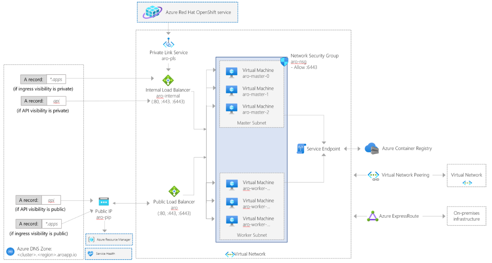
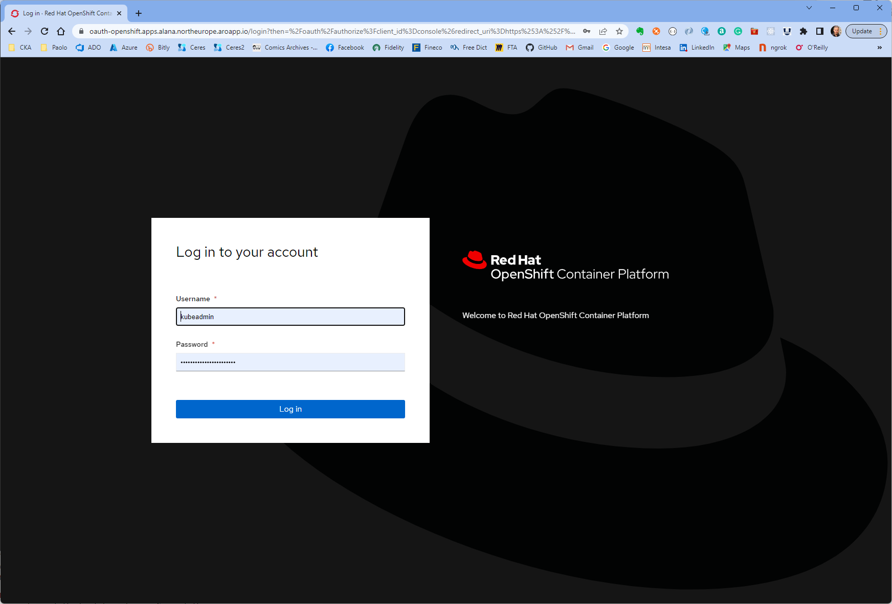
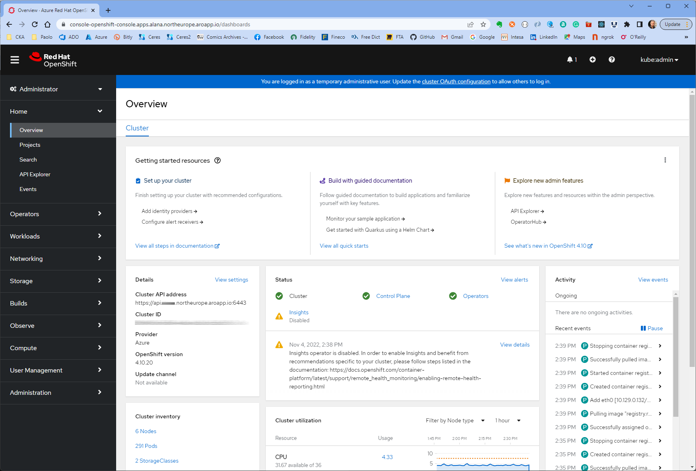
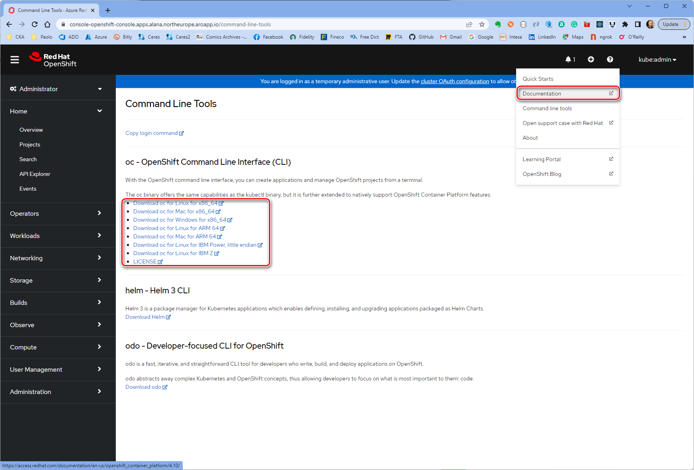

# Deploy an Azure Red Hat OpenShift cluster with Terraform and AzAPI Provider

[Azure Red Hat OpenShift](https://learn.microsoft.com/en-us/azure/openshift/intro-openshift) builds on top and extends [Kubernetes](https://kubernetes.io/) features. [Red Hat OpenShift](https://www.openshift.com/) is a cloud-based Kubernetes platform that helps developers build applications. It offers automated installation, upgrades, and life cycle management. OpenShift gives customers the ability to build, deploy, and scale applications faster both on-premises and in the cloud. It also protects your development infrastructure at scale with enterprise-grade security. Running containers in production with Kubernetes requires additional tools and resources. This often includes needing to juggle image registries, storage management, networking solutions, and logging and monitoring tools - all of which must be versioned and tested together. Building container-based applications requires even more integration work with middleware, frameworks, databases, and CI/CD tools. Azure Red Hat OpenShift combines all this into a single platform, bringing ease of operations to IT teams while giving application teams what they need to execute.

[Azure Red Hat OpenShift](https://learn.microsoft.com/en-us/azure/openshift/intro-openshift) is jointly engineered, operated, and supported by Red Hat and Microsoft to provide an integrated support experience. There are no virtual machines to operate, and no patching is required. Master, infrastructure, and application nodes are patched, updated, and monitored on your behalf by Red Hat and Microsoft. Your Azure Red Hat OpenShift clusters are deployed into your Azure subscription and are included on your Azure bill.

You can choose your own registry, networking, storage, and CI/CD solutions, or use the built-in solutions for automated source code management, container and application builds, deployments, scaling, health management, and more. Azure Red Hat OpenShift provides an integrated sign-on experience through Azure Active Directory. For more information, see [Azure Red Hat OpenShift](https://learn.microsoft.com/en-us/azure/openshift/intro-openshift).

## Prerequisites

- If you want to run Azure CLI locally, install [Azure CLI](https://learn.microsoft.com/en-us/cli/azure/install-azure-cli)
- An Azure account with an active subscription is required. If you don't already have one, you can [create an account for free](https://azure.microsoft.com/free/?WT.mc_id=A261C142F). If you don't have one, create a [free Azure account](https://azure.microsoft.com/free/) before you begin.
- [Visual Studio Code](https://code.visualstudio.com/) installed on one of the [supported platforms](https://code.visualstudio.com/docs/supporting/requirements#_platforms) along with the [HashiCorp Terraform](hhttps://marketplace.visualstudio.com/items?itemName=HashiCorp.terraform).
- Ability to assign User Access Administrator and Contributor roles. If you lack this ability, contact your Azure Active Directory admin to manage roles.
- A Red Hat account. If you don't have one, you'll have to [register for an account](https://www.redhat.com/wapps/ugc/register.html).
- A pull secret for your Azure Red Hat OpenShift cluster. [Download the pull secret file from the Red Hat OpenShift Cluster Manager web site](https://cloud.redhat.com/openshift/install/azure/aro-provisioned).
- If you want to run the Azure PowerShell code locally, [Azure PowerShell](/powershell/azure/install-az-ps).

## What is AzAPI Provider?

The [AzAPI Provider](https://registry.terraform.io/providers/azure/azapi/latest/docs) is a very thin layer on top of the Azure ARM REST APIs. This provider compliments the [AzureRM provider](https://registry.terraform.io/providers/hashicorp/azurerm/latest/docs) by enabling the management of Azure resources that are not yet or may never be supported in the AzureRM provider such as private/public preview services and features. The [AzAPI provider](https://docs.microsoft.com/en-us/azure/developer/terraform/overview-azapi-provider) enables you to manage any Azure resource type using any API version. This provider complements the AzureRM provider by enabling the management of new Azure resources and properties (including private preview). For more information, see [Overview of the Terraform AzAPI provider](https://docs.microsoft.com/en-us/azure/developer/terraform/overview-azapi-provider).

## Architecture

This sample contains Terraform modules to create the following resources:

- A virtual network hosting the master and worker nodes of the Azure Red Hat OpenShift cluster.
- A `master` subnet hosting the master nodes of the the Azure Red Hat OpenShift cluster.
- A `worker` subnet hosting the worker nodes of the the Azure Red Hat OpenShift cluster.
- An Azure Red Hat OpenShift cluster
- A role assignment that assigns the `Contributor` role to the cluster service principal scoped to the virtual network resource.
- A role assignment that assigns the `Contributor` role to the service principal of the Azure Red Hat OpenShift resource provider scoped to the virtual network resource.

The following architecture diagram illustrates the network topology of an Azure Red Hat OpenShift cluster. 



For more information, see [Network concepts for Azure Red Hat OpenShift](https://learn.microsoft.com/en-us/azure/openshift/concepts-networking).

## Terraform modules

The following table contains the code of the `modules/contains_apps/main.tf` Terraform module used to create the Azure Container Apps environment, Dapr components, and Container Apps.

```terraform
terraform {
  required_version = ">= 1.0"
  required_providers {
    azurerm = {
      source  = "hashicorp/azurerm"
      version = ">=3.3.0"
    }
    azapi = {
      source  = "Azure/azapi"
      version = ">=1.0.0"
    }
  }
}

provider "azurerm" {
  features {}
}

provider "azapi" {
}

data "azurerm_client_config" "current" {
}

locals {
  resource_group_id = "/subscriptions/${data.azurerm_client_config.current.subscription_id}/resourceGroups/aro-${var.domain}-${var.location}"
}

resource "random_string" "resource_prefix" {
  length  = 6
  special = false
  upper   = false
  numeric  = false
}

resource "azurerm_virtual_network" "virtual_network" {
  name                = "${var.resource_prefix != "" ? var.resource_prefix : random_string.resource_prefix.result}VNet"
  address_space       = var.virtual_network_address_space
  location            = var.location
  resource_group_name = var.resource_group_name
  tags                = var.tags
  
  lifecycle {
    ignore_changes = [
        tags
    ]
  }
}

resource "azurerm_subnet" "master_subnet" {
  name                                           = var.master_subnet_name
  resource_group_name                            = var.resource_group_name
  virtual_network_name                           = azurerm_virtual_network.virtual_network.name
  address_prefixes                               = var.master_subnet_address_space
  private_link_service_network_policies_enabled  = false
  service_endpoints                              = ["Microsoft.ContainerRegistry"]
}

resource "azurerm_subnet" "worker_subnet" {
  name                                           = var.worker_subnet_name
  resource_group_name                            = var.resource_group_name
  virtual_network_name                           = azurerm_virtual_network.virtual_network.name
  address_prefixes                               = var.worker_subnet_address_space
  service_endpoints                              = ["Microsoft.ContainerRegistry"]
}

resource "azurerm_role_assignment" "aro_cluster_service_principal_network_contributor" {
  scope                = azurerm_virtual_network.virtual_network.id
  role_definition_name = "Contributor"
  principal_id         = var.aro_cluster_aad_sp_object_id
  skip_service_principal_aad_check = true
}

resource "azurerm_role_assignment" "aro_resource_provider_service_principal_network_contributor" {
  scope                = azurerm_virtual_network.virtual_network.id
  role_definition_name = "Contributor"
  principal_id         = var.aro_rp_aad_sp_object_id
  skip_service_principal_aad_check = true
}

data "azurerm_resource_group" "resource_group" {
  name                = var.resource_group_name
}

resource "azapi_resource" "aro_cluster" {
  name      = "${var.resource_prefix != "" ? var.resource_prefix : random_string.resource_prefix.result}Aro"
  location  = var.location
  parent_id = data.azurerm_resource_group.resource_group.id
  type      = "Microsoft.RedHatOpenShift/openShiftClusters@2022-04-01"
  tags      = var.tags
  
  body = jsonencode({
    properties = {
      clusterProfile = {
        domain               = var.domain
        fipsValidatedModules = var.fips_validated_modules
        resourceGroupId      = local.resource_group_id
        pullSecret           = var.pull_secret
      }
      networkProfile = {
        podCidr              = var.pod_cidr
        serviceCidr          = var.service_cidr
      }
      servicePrincipalProfile = {
        clientId             = var.aro_cluster_aad_sp_client_id
        clientSecret         = var.aro_cluster_aad_sp_client_secret
      }
      masterProfile = {
        vmSize               = var.master_node_vm_size
        subnetId             = azurerm_subnet.master_subnet.id
        encryptionAtHost     = var.master_encryption_at_host
      }
      workerProfiles = [
        {
          name               = var.worker_profile_name
          vmSize             = var.worker_node_vm_size
          diskSizeGB         = var.worker_node_vm_disk_size
          subnetId           = azurerm_subnet.worker_subnet.id
          count              = var.worker_node_count
          encryptionAtHost   = var.worker_encryption_at_host
        }
      ]
      apiserverProfile = {
        visibility           = var.api_server_visibility
      }
      ingressProfiles = [
        {
          name               = var.ingress_profile_name
          visibility         = var.ingress_visibility
        }
      ]
    }
  })

  lifecycle {
    ignore_changes = [
        tags
    ]
  }
}
```

As you can see, the module uses an [azapi_resource](https://docs.microsoft.com/en-us/azure/developer/terraform/overview-azapi-provider) to create a resource of type [Microsoft.RedHatOpenShift/openShiftClusters](https://learn.microsoft.com/en-us/azure/templates/microsoft.redhatopenshift/2020-04-30/openshiftclusters?pivots=deployment-language-bicep). You can use an [azapi_resource](https://docs.microsoft.com/en-us/azure/developer/terraform/overview-azapi-provider) to fully manage any Azure (control plane) resource (API) with full CRUD. Example Use Cases:

- New preview service
- New feature added to existing service
- Existing feature or service not currently supported by the AzureRM provider

For more information, see [Overview of the Terraform AzAPI provider](https://docs.microsoft.com/en-us/azure/developer/terraform/overview-azapi-provider).

## Deploy the sample

All the resources deployed by the modules share the same name prefix. Make sure to configure a name prefix by setting a value for the `resource_prefix` variable defined in the `variables.tf` file. If you set the value of the `resource_prefix` variable to an empty string, the `main.tf` module will use a `random_string` resource to automatically create a name prefix for the Azure resources. You can use the `deploy.sh` bash script to deploy the sample:

Before deploying the cluster, download a pull secret for your Azure Red Hat OpenShift cluster anc opy the file to the same folder of the `deploy.sh` script file with the name `pull-secret.txt`. For more information, see [how to download the pull secret file from the Red Hat OpenShift Cluster Manager web site](https://cloud.redhat.com/openshift/install/azure/aro-provisioned).

```bash
#!/bin/bash

# Print the menu
echo "================================================="
echo "Install ARO Cluster. Choose an option (1-5): "
echo "================================================="
options=(
  "Terraform Init"
  "Terraform Validate"
  "Terraform Plan"
  "Terraform Apply"
  "Quit"
)

# Select an option
COLUMNS=0
select opt in "${options[@]}"; do
  case $opt in
  "Terraform Init")
    terraform init
    exit
    ;;
  "Terraform Validate")
    terraform validate
    exit
    ;;
  "Terraform Plan")
    op="plan"
    break
    ;;
  "Terraform Apply")
    op="apply"
    break
    ;;
  "Quit")
    exit
    ;;
  *) echo "Invalid option $REPLY" ;;
  esac
done

# ARO cluster name
resourcePrefix="<azure-resources-name-prefix>"
aroDomain="${resourcePrefix,,}"
aroClusterServicePrincipalDisplayName="${resourcePrefix,,}-aro-sp-${RANDOM}"
pullSecret=$(cat pull-secret.txt)

# Name and location of the resource group for the Azure Red Hat OpenShift (ARO) cluster
aroResourceGroupName="${resourcePrefix}RG"
location="northeurope"

# Subscription id, subscription name, and tenant id of the current subscription
subscriptionId=$(az account show --query id --output tsv)
subscriptionName=$(az account show --query name --output tsv)
tenantId=$(az account show --query tenantId --output tsv)

# Register the necessary resource providers
az provider register --namespace 'Microsoft.RedHatOpenShift' --wait
az provider register --namespace 'Microsoft.Compute' --wait
az provider register --namespace 'Microsoft.Storage' --wait
az provider register --namespace 'Microsoft.Authorization' --wait

# Check if the resource group already exists
echo "Checking if [$aroResourceGroupName] resource group actually exists in the [$subscriptionName] subscription..."

az group show --name $aroResourceGroupName &>/dev/null

if [[ $? != 0 ]]; then
  echo "No [$aroResourceGroupName] resource group actually exists in the [$subscriptionName] subscription"
  echo "Creating [$aroResourceGroupName] resource group in the [$subscriptionName] subscription..."

  # Create the resource group
  az group create --name $aroResourceGroupName --location $location 1>/dev/null

  if [[ $? == 0 ]]; then
    echo "[$aroResourceGroupName] resource group successfully created in the [$subscriptionName] subscription"
  else
    echo "Failed to create [$aroResourceGroupName] resource group in the [$subscriptionName] subscription"
    exit
  fi
else
  echo "[$aroResourceGroupName] resource group already exists in the [$subscriptionName] subscription"
fi

# Create the service principal for the Azure Red Hat OpenShift (ARO) cluster
echo "Creating service principal with [$aroClusterServicePrincipalDisplayName] display name in the [$tenantId] tenant..."
az ad sp create-for-rbac \
  --name $aroClusterServicePrincipalDisplayName >app-service-principal.json

aroClusterServicePrincipalClientId=$(jq -r '.appId' app-service-principal.json)
aroClusterServicePrincipalClientSecret=$(jq -r '.password' app-service-principal.json)
aroClusterServicePrincipalObjectId=$(az ad sp show --id $aroClusterServicePrincipalClientId | jq -r '.id')

# Assign the User Access Administrator role to the new service principal with resource group scope
roleName='User Access Administrator'
az role assignment create \
  --role "$roleName" \
  --assignee-object-id $aroClusterServicePrincipalObjectId \
  --resource-group $aroResourceGroupName \
  --assignee-principal-type 'ServicePrincipal' >/dev/null

if [[ $? == 0 ]]; then
  echo "[$aroClusterServicePrincipalDisplayName] service principal successfully assigned [$roleName] with [$aroResourceGroupName] resource group scope"
else
  echo "Failed to assign [$roleName] role with [$aroResourceGroupName] resource group scope to the [$aroClusterServicePrincipalDisplayName] service principal"
  exit
fi

# Assign the Contributor role to the new service principal with resource group scope
roleName='Contributor'
az role assignment create \
  --role "$roleName" \
  --assignee-object-id $aroClusterServicePrincipalObjectId \
  --resource-group $aroResourceGroupName \
  --assignee-principal-type 'ServicePrincipal' >/dev/null

if [[ $? == 0 ]]; then
  echo "[$aroClusterServicePrincipalDisplayName] service principal successfully assigned [$roleName] with [$aroResourceGroupName] resource group scope"
else
  echo "Failed to assign [$roleName] role with [$aroResourceGroupName] resource group scope to the [$aroClusterServicePrincipalDisplayName] service principal"
  exit
fi

# Get the service principal object ID for the OpenShift resource provider
aroResourceProviderServicePrincipalObjectId=$(az ad sp list --display-name "Azure Red Hat OpenShift RP" --query [0].id -o tsv)

if [[ $op == 'plan' ]]; then
  terraform plan \
    -compact-warnings \
    -out main.tfplan \
    -var "resource_prefix=$resourcePrefix" \
    -var "location=$location" \
    -var "domain=$aroDomain" \
    -var "pull_secret=$pullSecret" \
    -var "aro_cluster_aad_sp_client_id=$aroClusterServicePrincipalClientId" \
    -var "aro_cluster_aad_sp_client_secret=$aroClusterServicePrincipalClientSecret" \
    -var "aro_cluster_aad_sp_object_id=$aroClusterServicePrincipalObjectId" \
    -var "aro_rp_aad_sp_object_id=$aroResourceProviderServicePrincipalObjectId"
else
  if [[ -f "main.tfplan" ]]; then
    terraform apply \
      -compact-warnings \
      -auto-approve \
      main.tfplan \
      -var "resource_prefix=$resourcePrefix" \
      -var "resource_group_name=$aroResourceGroupName" \
      -var "location=$location" \
      -var "domain=$aroDomain" \
      -var "pull_secret=$pullSecret" \
      -var "aro_cluster_aad_sp_client_id=$aroClusterServicePrincipalClientId" \
      -var "aro_cluster_aad_sp_client_secret=$aroClusterServicePrincipalClientSecret" \
      -var "aro_cluster_aad_sp_object_id=$aroClusterServicePrincipalObjectId" \
      -var "aro_rp_aad_sp_object_id=$aroResourceProviderServicePrincipalObjectId"
  else
    terraform apply \
      -compact-warnings \
      -auto-approve \
      -var "resource_prefix=$resourcePrefix" \
      -var "resource_group_name=$aroResourceGroupName" \
      -var "location=$location" \
      -var "domain=$aroDomain" \
      -var "pull_secret=$pullSecret" \
      -var "aro_cluster_aad_sp_client_id=$aroClusterServicePrincipalClientId" \
      -var "aro_cluster_aad_sp_client_secret=$aroClusterServicePrincipalClientSecret" \
      -var "aro_cluster_aad_sp_object_id=$aroClusterServicePrincipalObjectId" \
      -var "aro_rp_aad_sp_object_id=$aroResourceProviderServicePrincipalObjectId"
  fi
fi
```

## Connect to the cluster

You can log into the cluster using the `kubeadmin` user.  Run the following command to find the password for the `kubeadmin` user.

```bash
az aro list-credentials \
  --name $CLUSTER \
  --resource-group $RESOURCEGROUP
```

The following example output shows what the password will be in `kubeadminPassword`.

```json
{
  "kubeadminPassword": "<generated password>",
  "kubeadminUsername": "kubeadmin"
}
```

You can find the cluster console URL by running the following command, which will look like `https://console-openshift-console.apps.<random>.<region>.aroapp.io/`.

```bash
 az aro show \
    --name $CLUSTER \
    --resource-group $RESOURCEGROUP \
    --query "consoleProfile.url" -o tsv
```

Launch the console URL in a browser and login using the `kubeadmin` credentials.



If entered credentials are correct, you will have access to the [OpenShift Web Console](https://docs.openshift.com/container-platform/4.6/web_console/web-console-overview.html) that provides a graphical user interface to visualize your project data and perform administrative, management, and troubleshooting tasks.



## Install the OpenShift CLI

Once you're logged into the OpenShift Web Console, click on the **?** on the top right and then on **Command Line Tools**. Download the release appropriate to your machine.



You can also download the [latest release of the CLI](https://mirror.openshift.com/pub/openshift-v4/clients/ocp/latest/) appropriate to your machine.

If you're running the commands on the Azure Cloud Shell, download the latest OpenShift 4 CLI for Linux.

```bash
cd ~
wget https://mirror.openshift.com/pub/openshift-v4/clients/ocp/latest/openshift-client-linux.tar.gz

mkdir openshift
tar -zxvf openshift-client-linux.tar.gz -C openshift
echo 'export PATH=$PATH:~/openshift' >> ~/.bashrc && source ~/.bashrc
```

## Connect using the OpenShift CLI

Retrieve the API server's address.

```bash
apiServer=$(az aro show -g $RESOURCEGROUP -n $CLUSTER --query apiserverProfile.url -o tsv)
```

Login to the OpenShift cluster's API server using the following command. Replace **\<kubeadmin password>** with the password you just retrieved.

```bash
oc login $apiServer -u kubeadmin -p <kubeadmin password>
```

## Next steps

In this article, you learned how to create an Azure Red Hat OpenShift cluster running OpenShift 4 using the [AzAPI Provider](https://registry.terraform.io/providers/azure/azapi/latest/docs) and [Terraform](hhttps://marketplace.visualstudio.com/items?itemName=HashiCorp.terraform).

Advance to the next article to learn how to configure the cluster for authentication using Azure Active Directory.

- [Rotate service principal credentials for your Azure Red Hat OpenShift (ARO) Cluster](https://learn.microsoft.com/en-us/azure/openshift/howto-service-principal-credential-rotation)
- [Configure authentication with Azure Active Directory using the command line](https://learn.microsoft.com/en-us/azure/openshift/configure-azure-ad-cli)
- [Configure authentication with Azure Active Directory using the Azure portal and OpenShift web console](https://learn.microsoft.com/en-us/azure/openshift/configure-azure-ad-cli)